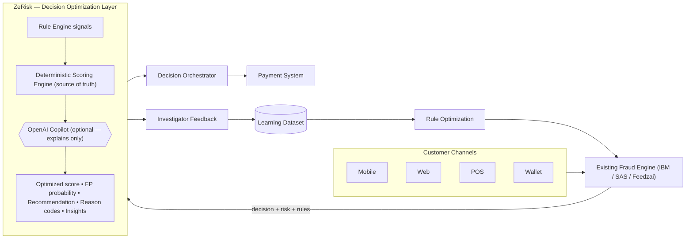

# ZeRisk — منصة تحسين قرارات الاحتيال

> **Live demo:** http://zerisk.168.119.63.163.sslip.io

> An intelligent **decision-optimization layer** that sits **above** your existing fraud engines
> (IBM Safer Payments, SAS, Feedzai, internal rule engines) — reducing false declines and
> operational cost while **preserving** fraud protection and improving customer experience.

ZeRisk does **not** replace your fraud system. It re-analyses each decision, estimates the
**false-positive probability**, produces an **optimized risk score**, explains *why* the legacy
engine may be wrong, recommends **Approve / Review / Reject / Monitor**, suggests rule improvements,
and simulates the financial & operational impact **before** any change is applied.

> ⚠️ **Disclaimer:** ZeRisk provides decision-support recommendations. Final production
> enforcement depends on the financial institution's approved governance policies. In this MVP,
> decision changes are **simulated** and never execute real financial transactions.

---

## 1. Problem

Existing fraud engines protect institutions but frequently **reject legitimate transactions**
(false positives) due to strict, static rules and incomplete context. False positives cause lost
revenue, customer frustration and churn, more support calls, high manual-investigation cost, lower
approval rates, and poor customer experience.

## 2. Solution

ZeRisk ingests the transaction, the **original engine decision & risk score**, triggered
rules, customer history, device/beneficiary trust, and investigator outcomes — then:

- Re-scores the transaction with a **deterministic, explainable** engine.
- Estimates **false-positive probability**.
- Recommends a decision with a **confidence** score and **reason codes**.
- Recommends concrete **rule optimizations**.
- Simulates **financial & operational impact** on historical data.

**Value:** *Reduce false declines and operational costs while preserving fraud protection and
improving customer experience.*

---

## 3. Architecture



**Design principle:** the local scoring engine is *always* the source of truth. The OpenAI Copilot
only **explains, summarizes and recommends** — it never approves/rejects a transaction, and the app
runs fully **offline** without any API key.

Data flow inside the app:

```
demo-data.ts (deterministic generator)
   -> scoring.ts (per-transaction AI result)
   -> analytics.ts / simulation.ts / financial.ts (pure aggregations)
   -> server components (getDataset) -> client views (charts, tables)
   -> server actions (mutations) -> in-memory overlay -> revalidate -> live dashboards
Prisma seed mirrors the same generator into SQLite for real persistence.
```

---

## 4. Tech Stack

| Layer | Choice |
|------|--------|
| Framework | **Next.js 16** (App Router, route group `(app)`), React 19, TypeScript **strict** |
| Styling | **Tailwind CSS v4** (light + coral design system), custom shadcn-style primitives |
| Icons / Charts / Motion | lucide-react · Recharts 3 · Framer Motion 12 |
| Data / ORM | **Prisma 6** + **SQLite** (18 models) |
| AI scoring | Modular, deterministic TypeScript engine (`src/lib/scoring.ts`) — no paid API required |
| Optional LLM | OpenAI **Responses API** via `fetch` (no SDK), full local fallback |
| Tests | Vitest (scoring / financial / simulation) |
| i18n | Arabic (RTL, default) + English toggle |

---

## 5. Getting Started

```bash
# 1. Install (offline-capable after this step)
npm install                 # runs `prisma generate` via postinstall

# 2. Create & seed the SQLite database
npm run db:setup            # prisma db push + seed  (127 txns, 30 customers, 10 rules, ...)

# 3. Run
npm run dev                 # http://localhost:3000
```

Other commands:

```bash
npm run build      # prisma generate + production build
npm run start      # run the production build
npm test           # unit tests (scoring, financial, simulation)
npm run seed       # re-seed the database
npm run db:reset   # reset + re-seed
npm run lint       # ESLint (0 problems)
```

### Environment (all optional — app works offline)

`.env` (already created):

```
DATABASE_URL="file:./dev.db"
OPENAI_API_KEY=            # leave blank -> Copilot runs on the local engine
OPENAI_MODEL=gpt-5.5
```

When `OPENAI_API_KEY` is set, the Copilot refines wording via the OpenAI Responses API, grounded on
locally-computed facts. Without it, everything still works — the header shows **"AI Copilot Offline"**.

---

## 6. Roles (demo role switcher, top bar)

No real auth. Switch between **Executive, Fraud Manager, Investigator, Data Scientist, Auditor,
Administrator** from the top bar. Language toggle (العربية / English) is next to it. Arabic/RTL is
the default.

---

## 7. Pages

Executive Dashboard · Live Transactions · Transaction Analysis · False Positive Analytics ·
Rule Intelligence · What-If Simulation · AI Insights · **Fraud AI Copilot** · Financial Impact ·
Investigation Feedback · Model Monitoring · Integration Center · Settings & Governance ·
**Demo Story** · Why ZeRisk?

---

## 8. Demo Story (5–7 min)

Open **سيناريو العرض / Demo Story** (`/demo`) and click through 5 animated steps, all driven by the
**live** engine output for transaction `TX-2026-000145`:

1. **Problem** — a legitimate customer transaction was rejected.
2. **Original engine** — high risk score, decision **Reject**, rules **FR-017** + **FR-024** triggered.
3. **ZeRisk analysis** — known device, known beneficiary, successful MFA, normal behavior, low
   historical risk.
4. **AI recommendation** — **Approve**, low optimized score, ~93% false-positive probability.
5. **Business impact** — recovered revenue, avoided complaint, reduced review cost, higher approval.

---

## 9. API Examples

```bash
# Re-score a decision
curl -X POST localhost:3000/api/v1/score -H 'Content-Type: application/json' -d '{
  "transactionId":"TX-2026-000145","amount":7200,"originalRiskScore":84,
  "triggeredRules":["FR-017","FR-024"],"deviceKnown":true,"beneficiaryKnown":true,"mfaPassed":true
}'
# -> {"optimizedRiskScore":17,"falsePositiveProbability":93,"recommendation":"APPROVE","confidence":97,...}

curl -X POST localhost:3000/api/v1/feedback     -d '{"transactionId":"TX-2026-000212","outcome":"CONFIRMED_FRAUD"}' -H 'Content-Type: application/json'
curl -X POST localhost:3000/api/v1/simulations  -d '{"ruleId":"FR-017","proposedThreshold":8500}'          -H 'Content-Type: application/json'
curl      localhost:3000/api/v1/rules
curl      localhost:3000/api/v1/analytics/summary
# Copilot chat (grounded on app data; works offline)
curl -X POST localhost:3000/api/copilot -d '{"question":"Explain rule FR-017","lang":"en"}' -H 'Content-Type: application/json'
```

---

## 10. AI Scoring Engine (deterministic & explainable)

`src/lib/scoring.ts` computes six sub-scores from the transaction context:

`device · behavioral · beneficiary · velocity · location · historical` (each 0–100).

They are combined with fixed weights (0.16 / 0.22 / 0.16 / 0.18 / 0.12 / 0.16), nudged by triggered
rule severity, to yield the **optimized risk score**. Thresholds:

| Optimized score | Recommendation |
|---|---|
| 0–34 | **APPROVE** |
| 35–59 | **MONITOR** |
| 60–79 | **REVIEW** |
| 80–100 | **REJECT** |

…then adjusted by **false-positive probability**, strong fraud indicators, confidence, and
**governance** guardrails (max override amount, min confidence). The same input **always** produces
the same output (no randomness) and every recommendation ships with signed **reason codes** in
Arabic & English. Covered by unit tests.

## 10b. Data-driven learning loop

Nothing on the dashboards is hardcoded — every KPI, rule stat, insight and chart is
**computed from the seeded database records** (`computeKpis`, `computeProfiles`, `computeRuleStats`).

The MVP demonstrates a controlled, deterministic learning loop:

```
Transaction → Legacy engine → Scoring engine → OpenAI analysis (optional)
   → Investigator feedback → Labeled outcome → Adaptive risk profiles
   → Calibration update (ModelVersion FL-MVP-1.x) → Improved future recommendations
```

- **Adaptive risk profiles** (`src/lib/profiles.ts`) for customer / device / beneficiary /
  channel / segment / rule, recalculated from confirmed labels (`LEGITIMATE` / `CONFIRMED_FRAUD`).
- **Calibration** (`src/lib/learning.ts`) derives weighted/Bayesian factors (device-trust boost,
  false-positive calibration, per-rule weights, segment/channel risk) from those profiles. The
  scoring engine consumes them, so the **same DB state + input always yields the same result**.
- **Recalibrate Model** (Learning / Evidence pages) reads all confirmed outcomes, recomputes
  statistics, bumps the model version only when new labels exist, records a `LearningEvent` with a
  real before/after diff, and updates dashboards.
- **Live learning demo** on `/learning`: confirm `TX-DEMO-LEARN-001` legitimate → recalibrate →
  `TX-DEMO-LEARN-002` (same device + beneficiary) shows a lower optimized score, higher
  false-positive probability and higher confidence — caused by persisted feedback + recalculated
  statistics, not a front-end animation.
- **MVP Evidence** page (`/evidence`) surfaces the computed proof (FP rate before/after, recall
  before/after, false negatives caught, model version, labeled outcomes, last recalibration) and
  exports it as JSON.
- **OpenAI analysis** (`/api/v1/ai/transaction/:id`) is given dynamic, locally-computed context and
  its JSON is **validated with Zod** (source references required); invalid output is rejected and
  the local engine is used — decisions/scores are always local.

## 11. Financial Impact Formulas

```
Revenue recovered      = recovered legitimate txns x avg revenue per txn
Manual review savings  = reduced reviews x investigation cost
Support savings        = reduced complaints x support cost
Customer retention     = customers retained x churn cost
Fraud exposure         = additional missed fraud x avg fraud loss
Net value              = revenue + review savings + support savings + retention
                         - fraud exposure - platform cost
```

All assumptions are editable on the **Financial Impact** page and recalculate instantly
(conservative / expected / optimistic scenarios, ROI, payback period).

---

## 12. Database Models (Prisma / SQLite)

`Customer, Device, Beneficiary, FraudRule, RuleVersion, Transaction, RuleTrigger, FraudDecision,
AIRecommendation, InvestigationCase, InvestigatorFeedback, Simulation, SimulationResult, Insight,
ModelMetric, Integration, AuditLog, FinancialAssumption` (18 models). Seeded with 30 customers,
22 devices, 25 beneficiaries, 10 rules, 127 transactions, 25 investigation cases, 20 insights,
12 months of metrics, 12 integrations.

---

## 13. Limitations

- Decisions are **simulated** — no real transaction is executed or enforced.
- Live mutations (feedback, decision overrides) update an in-memory overlay for the session; the
  seeded SQLite data is the durable baseline (use **Reset demo data** in Settings to restore).
- Portfolio-level figures project the seeded live sample to a monthly scale for realism.
- The OpenAI Copilot is optional and only refines wording; facts/decisions are always local.

## 14. Future Roadmap

- **Phase 1** — Decision analytics · false-positive detection · rule performance monitoring · historical simulations.
- **Phase 2** — Real-time API integration · investigator-feedback learning · multi-model support · advanced behavioral analytics.
- **Phase 3** — Federated learning · cross-institution fraud intelligence · Arabic fraud-language models · real-time adaptive decisioning.

---

## 15. Next Production Steps

Replace the in-memory overlay with persisted Prisma writes on every action; connect real fraud-engine
webhooks; add authn/z + real four-eyes approval; move scoring to a versioned model registry with
A/B rollout; stream metrics to a warehouse; and harden the API (authz, rate limiting, audit).
